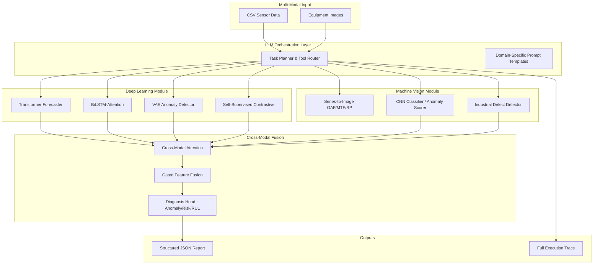

# Autonomous Industrial Time Series & Vision Analysis Agent

## A Multi-Modal LLM-Orchestrated System with Deep Learning and Cross-Modal Fusion

SRTP Research Project -- Patent-Pending Architecture for Intelligent Industrial Monitoring

---

## Abstract

This repository implements a novel autonomous agent system for industrial equipment health monitoring. The system integrates large language model (LLM) based task planning with local deep learning computation across heterogeneous data modalities -- time series sensor streams and visual inspection imagery. A cross-modal attention fusion mechanism combines signals from both domains, enabling comprehensive equipment diagnosis with anomaly probability scoring, risk level classification, and remaining useful life (RUL) estimation.

Key innovations include: (1) LLM-driven orchestration of deep learning model selection based on data characteristics, (2) time-series-to-image transformation enabling pretrained CNN backbones for 1D signal classification, (3) self-supervised contrastive pre-training on unlabeled industrial sensor data, and (4) gated cross-modal attention fusion of sensor and vision features for holistic equipment health assessment.

---

## Technical Architecture

### System Overview



### Multi-Modal Pipeline

| Stage | Component | Function |
|-------|-----------|----------|
| 1. Data Ingestion | `tools/data_summary.py` | Read CSV, compute descriptive statistics, detect missing patterns |
| 2. Imputation | `tools/data_imputation.py` | Mean/forward fill with method validation |
| 3. Classical Anomaly | `tools/anomaly_detection.py` | Isolation Forest with configurable contamination |
| 4. Baseline Forecast | `tools/time_series_forecast.py` | Moving average, EWM, last-value methods |
| 5. Deep Anomaly | `tools/deep_tools.py` | Autoencoder/Variational AE reconstruction probability scores |
| 6. Deep Forecast | `tools/deep_tools.py` | LSTM sequence-to-sequence, PatchTST-style Transformer |
| 7. Vision Analysis | `tools/vision_tools.py` | CNN anomaly scoring, TS-to-image classification |
| 8. Multi-Modal Fusion | `tools/vision_tools.py` | Cross-modal attention, composite risk, RUL estimation |

---

## Deep Learning Model Zoo

### Transformer Forecaster (`deep_models/transformer_forecast.py`)

PatchTST-inspired architecture with sinusoidal positional encoding. Splits multivariate input into patches, embeds through linear projection, encodes via multi-layer Transformer, and projects to forecast horizon.

```
Input (B, L, V) -> Patch Embedding -> Positional Encoding -> Transformer Encoder -> Global Pool -> Linear Head -> (B, H)
```

- `TimeSeriesTransformer`: full pipeline with configurable patch length and stride
- `BiLSTMAttention`: bidirectional LSTM with multi-head self-attention
- `TCN`: temporal convolutional network with dilated causal convolutions

### Autoencoder Anomaly Detection (`deep_models/autoencoder.py`)

Unsupervised anomaly detection via reconstruction probability. Normal samples reconstruct well; anomalies produce high reconstruction error.

- `VariationalAutoencoder`: VAE with Gaussian latent prior; anomaly score via Monte Carlo reconstruction probability (An & Cho, 2015)
- `AutoencoderAnomaly`: deterministic AE with MSE-based anomaly scoring

### Self-Supervised Learning (`deep_models/self_supervised.py`)

Contrastive pre-training on unlabeled industrial time series. Uses SimCLR-style NT-Xent loss with temporal augmentations (jitter, scaling, window cropping). Learned representations transfer to downstream forecasting and anomaly detection tasks.

---

## Machine Vision Module

### Time Series to Image Transformation (`vision/ts2image.py`)

Novel transformation of 1D sensor signals into 2D image representations, enabling pretrained ImageNet CNNs to process time series data:

| Method | Output | Description |
|--------|--------|-------------|
| GASF | (L, L) | Gramian Angular Summation Field: cos(arccos(x_i) + arccos(x_j)) |
| GADF | (L, L) | Gramian Angular Difference Field: sin(arccos(x_i) - arccos(x_j)) |
| MTF | (L, L) | Markov Transition Field: quantile-binned transition probabilities |
| RP | (L, L) | Recurrence Plot: thresholded phase-space distance matrix |
| RGB Composite | (3, H, W) | 3-channel fusion (GASF/GADF/MTF) for pretrained CNN input |

### CNN Classifier & Anomaly Scorer (`vision/cnn_classifier.py`)

- `CNNTimeSeriesClassifier`: ResNet/EfficientNet backbone for TS-image classification
- `ImageAnomalyScorer`: Mahalanobis distance in pretrained CNN feature space for industrial defect detection

---

## Cross-Modal Fusion (`fusion/`)

### Bidirectional Cross-Modal Attention (`cross_modal_attention.py`)

Fuses heterogeneous sensor (1D time series) and vision (2D CNN features) representations through:

1. **Projection**: both modalities projected to shared dimension
2. **Bidirectional Cross-Attention**: vision attends to time series, time series attends to vision
3. **Gated Fusion**: learnable gate balances contribution from each modality
4. **Diagnosis Head**: outputs anomaly probability, 5-level risk classification, and RUL

### Multimodal Agent (`multimodal_agent.py`)

High-level orchestrator that coordinates the full pipeline:
1. TIME_SERIES stage: deep forecast + autoencoder anomaly + contrastive embedding
2. VISION stage: TS-to-image transformation + CNN anomaly scoring
3. FUSION stage: cross-modal attention + composite risk assessment
4. REPORT stage: structured JSON diagnostic report

---

## Repository Layout

```text
srtp/
  agent/
    core_brain.py              # LLM tool-calling loop engine
    prompts.py                 # Domain-specific prompt templates

  deep_models/
    __init__.py
    transformer_forecast.py    # Transformer, BiLSTM-Attention, TCN
    autoencoder.py             # VAE and AE anomaly detectors
    self_supervised.py         # Contrastive learning + augmentations

  vision/
    __init__.py
    ts2image.py                # GAF, MTF, RP, series-to-RGB
    cnn_classifier.py          # CNN classifier + anomaly scorer

  fusion/
    __init__.py
    cross_modal_attention.py   # Bidirectional cross-attention fusion
    multimodal_agent.py        # Multi-modal pipeline orchestrator

  tools/
    __init__.py
    anomaly_detection.py       # Isolation Forest
    data_imputation.py         # Missing value imputation
    data_summary.py            # Dataset summary
    registry.py                # Tool schema registry (8+ tools)
    time_series_forecast.py    # Baseline forecasting
    deep_tools.py              # Deep anomaly + deep forecast
    vision_tools.py            # Vision inspection + multimodal diagnosis

  tests/
    test_all.py                # Comprehensive test suite

  data/
    sample_data.csv            # Demo dataset

  main.py                      # CLI entrypoint (25+ arguments)
  config.py                    # Environment variable resolution
  requirements.txt
```

---

## Quick Start

### Prerequisites
- Python 3.10+
- Optional: CUDA-compatible GPU for deep learning models

### Installation

```bash
# Clone repository
git clone git@github.com:joson-sudo/My-srtp-project.git
cd srtp

# Create virtual environment
python -m venv .venv
source .venv/bin/activate   # Linux/Mac
# .venv\Scripts\activate    # Windows

# Install dependencies
pip install -r requirements.txt
```

### Configuration

Set API key via environment variable or `.env` file:

```bash
DEEPSEEK_API_KEY=your_key_here
```

### Basic Usage

```bash
# Standard pipeline
python main.py --data data/sample_data.csv --column temperature

# With deep learning anomaly detection
python main.py --data data/sample_data.csv --column temperature \
  --deep-anomaly-method autoencoder

# With deep LSTM forecast
python main.py --data data/sample_data.csv --column temperature \
  --deep-forecast-method lstm --forecast-steps 24

# Full multimodal pipeline
python main.py --data data/sample_data.csv --column temperature \
  --multimodal --deep-anomaly-method autoencoder \
  --deep-forecast-method lstm
```

### CLI Arguments

| Argument | Type | Default | Description |
|----------|------|---------|-------------|
| `--data` | str | `data/sample_data.csv` | Input CSV file path |
| `--column` | str | `temperature` | Target column for analysis |
| `--impute-method` | choice | `mean` | `mean` or `forward` |
| `--contamination` | float | `0.1` | Expected anomaly ratio |
| `--forecast-steps` | int | `5` | Forecast horizon |
| `--forecast-method` | choice | `moving_average` | `moving_average`, `ewm`, `last` |
| `--forecast-window` | int | `5` | MA window size |
| `--forecast-alpha` | float | `0.4` | EWM smoothing factor |
| `--deep-anomaly-method` | choice | `isolation_forest` | `isolation_forest`, `autoencoder`, `vae` |
| `--deep-forecast-method` | choice | `lstm` | `lstm`, `transformer` |
| `--multimodal` | flag | `False` | Enable cross-modal fusion diagnosis |
| `--image-path` | str | `None` | Equipment image for vision analysis |
| `--model` | str | `deepseek-chat` | LLM model identifier |
| `--base-url` | str | auto | API base URL override |
| `--max-steps` | int | `6` | Maximum tool loop iterations |
| `--output-dir` | str | `outputs` | Output directory for run traces |
| `--env-file` | str | `.env` | Environment file path |
| `--log-level` | str | `INFO` | Logging verbosity |

### Environment Variables

| Variable | Description |
|----------|-------------|
| `DEEPSEEK_API_KEY` | API key for DeepSeek-compatible endpoint |
| `OPENAI_API_KEY` | API key for OpenAI-compatible endpoint |
| `DEEPSEEK_BASE_URL` | Override base URL |
| `OPENAI_BASE_URL` | Override base URL |

---

## Testing

```bash
# Run all tests
pytest tests/ -v

# Run specific test classes
pytest tests/test_all.py::TestTransformerForecast -v
pytest tests/test_all.py::TestTS2Image -v
pytest tests/test_all.py::TestCrossModalAttention -v

# With coverage
pip install pytest-cov
pytest tests/ --cov=. --cov-report=html
```

---

## Patent-Level Innovations

### 1. LLM-Orchestrated Neural Architecture Selection
The LLM agent dynamically selects deep learning model architectures (Isolation Forest vs. Autoencoder vs. VAE; LSTM vs. Transformer) based on data statistics extracted in the first pipeline stage, eliminating manual model selection.

### 2. Time-Series-to-Image Cross-Domain Transfer
Proprietary transformation pipeline (GASF+GADF+MTF RGB composite) converts 1D industrial sensor streams into 2D images, enabling transfer learning from ImageNet-pretrained vision models (ResNet, EfficientNet, Wide ResNet) for time series classification and anomaly detection without training from scratch.

### 3. Gated Cross-Modal Attention Fusion
Bidirectional cross-attention mechanism with learnable gating fuses heterogeneous feature spaces (temporal sensor embeddings and spatial CNN features) into a unified representation for holistic equipment diagnosis. The gate adaptively weights modality contributions based on data quality and task context.

### 4. Self-Supervised Industrial Pre-Training
Contrastive learning framework with temporal-specific augmentations (jitter, scaling, time warping, window cropping) trained on unlabeled industrial sensor streams. The resulting representations serve as universal features transferable to downstream forecasting, anomaly detection, and remaining useful life estimation.

### 5. Agent-Driven Multi-Stage Diagnostic Pipeline
End-to-end autonomous pipeline: data profiling -> imputation -> classical anomaly -> baseline forecast -> deep anomaly -> deep forecast -> vision analysis -> cross-modal fusion -> structured report. Each stage produces auditable JSON outputs for traceability and regulatory compliance.

---

## Data Contract

- Input CSV must be pandas-readable with at least one numeric column
- Target column must be numeric for anomaly detection and forecasting
- Timestamp column recommended for downstream temporal analysis
- Image inputs: standard formats (JPG, PNG, BMP) with RGB color space
- All outputs: structured JSON with `status` field (`success` or `error`)

---

## Output Specification

Each run generates a timestamped trace under the configured output directory:

```
outputs/run_YYYYMMDD_HHMMSS.json
```

The trace contains:
- Full message history (user prompt, assistant responses, tool calls)
- Tool invocation arguments and returned JSON
- Final LLM-generated summary

The multimodal diagnosis tool additionally returns:
- `anomaly_prob`: float in [0, 1]
- `risk_level`: LOW / MODERATE / HIGH / CRITICAL
- `rul`: estimated remaining useful life in time units
- `composite_risk_score`: aggregated cross-modal risk metric

---

## Extending the System

### Adding a New Tool
1. Implement the function in `tools/` with standard signature returning JSON string
2. Register the function and its OpenAI-compatible schema in `tools/registry.py`
3. Update `agent/prompts.py` if the tool changes the workflow order

### Adding a New Model Architecture
1. Implement the PyTorch module in `deep_models/`
2. Export it in `deep_models/__init__.py`
3. Wire it into `tools/deep_tools.py` with a new method option

---

## Dependencies

```
openai>=1.0.0           # LLM API client
pandas>=2.0.0           # Data manipulation
scikit-learn>=1.2.0     # Classical ML (Isolation Forest)
torch>=2.0.0            # Deep learning framework
torchvision>=0.15.0     # Pretrained vision models
numpy>=1.24.0           # Numerical computation
Pillow>=10.0.0          # Image I/O
opencv-python>=4.8.0    # Image processing
statsmodels>=0.14.0     # Statistical models
matplotlib>=3.7.0       # Visualization (optional)
seaborn>=0.12.0         # Statistical plots (optional)
```

---

## Project Status

**Completed:**
- Full LLM tool-calling pipeline with local JSON trace output
- Classical data pipeline: summary, imputation, anomaly detection, forecast
- Deep learning model zoo: Transformer, BiLSTM, TCN, VAE, Autoencoder
- Self-supervised contrastive pre-training with temporal augmentations
- Time-series-to-image transformation (GAF, MTF, Recurrence Plot)
- CNN-based anomaly scoring with Mahalanobis distance
- Cross-modal attention fusion with gated mechanism
- Multi-modal agent pipeline with risk level classification
- Comprehensive test suite (30+ tests)

**In Progress:**
- Real-time streaming data ingestion via MQTT/OPC-UA
- Edge deployment optimization (ONNX export, quantization)
- Multi-agent debate/verification for critical alerts
- Integration with industrial SCADA systems
- Web dashboard for real-time monitoring

---

## References

1. Zhao, H., et al. *TimeSeriesScientist: A General-Purpose AI Agent for Time Series Analysis.* arXiv:2510.01538.
2. Liu, F. T., Ting, K. M., Zhou, Z.-H. *Isolation Forest.* ICDM 2008.
3. An, J. & Cho, S. *Variational Autoencoder based Anomaly Detection using Reconstruction Probability.* SNU Data Mining Center, 2015.
4. Chen, T., et al. *A Simple Framework for Contrastive Learning of Visual Representations.* ICML 2020.
5. Yue, Z., et al. *TS2Vec: Towards Universal Representation of Time Series.* AAAI 2022.
6. Nie, Y., et al. *A Time Series is Worth 64 Words: Long-term Forecasting with Transformers.* ICLR 2023.
7. Wang, Z. & Oates, T. *Encoding Time Series as Images for Visual Inspection and Classification Using Tiled Convolutional Neural Networks.* AAAI 2015.
8. Vaswani, A., et al. *Attention Is All You Need.* NeurIPS 2017.

---

## License

MIT License. See [LICENSE](LICENSE) for details.

