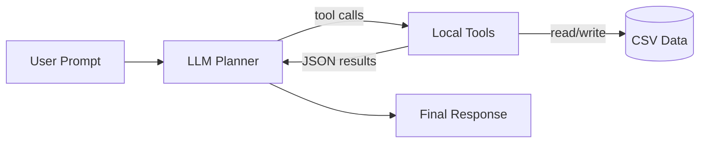

# 工业时间序列数据分析智能体
## Industrial Time Series Analyst Agent

**SRTP（大学生创新创业训练计划）项目**
> LLM 负责任务规划与工具编排，数值计算与模型执行全部在本地完成，确保结果可复现、可验证。

---

## 🎯 研究目标
本项目面向工业场景多变量时间序列数据，目标是形成从数据清洗到预测评估的端到端自动化流程。当前仓库提供一个可运行的 LLM 工具调用闭环，作为工程基座与研究原型。

## ✨ 核心亮点
- **闭环工具调用**：LLM 通过 Function Calling 自动完成“读数据 → 补缺失 → 查异常”的流水线。
- **本地可验证**：所有计算在本地 Python 环境执行，输出结构化 JSON 结果。
- **CSV 即插即用**：默认支持读取 [data/sample_data.csv](data/sample_data.csv) 并给出数据概况。
- **可扩展工具库**：在 [tools/](tools/) 中新增工具并注册即可接入工作流。

## 🧭 系统架构（当前实现）


## 🧠 目标架构（规划中）
计划基于 LangGraph 构建五节点流水线：
- Preprocess Agent：缺失值处理、异常值控制、数据质量分析。
- Analysis Agent：趋势、季节性、平稳性及潜在风险分析。
- Validation Agent：候选模型筛选、超参数搜索与验证集评估。
- Forecast Agent：单模型预测、加权集成预测、测试集指标计算。
- Report Agent：生成结构化实验总结与结果报告。

## ⚡ 快速开始
1) 创建并激活虚拟环境（可选）
```bash
python -m venv .venv
```

2) 安装依赖
```bash
pip install -r requirements.txt
```

3) 配置 API Key（在 .env 中写入一行，变量名需包含 DEEPSEEK）
```bash
DEEPSEEK_API_KEY=your_key_here
```

4) 运行主程序
```bash
python main.py
```

## 🧩 工具清单
| 工具 | 位置 | 说明 |
| --- | --- | --- |
| `extract_data_summary` | [main.py](main.py) | 读取 CSV 并输出列信息与缺失值统计 | 
| `impute_missing_values` | [tools/data_imputation.py](tools/data_imputation.py) | 均值/前向填补缺失值 | 
| `detect_anomalies` | [tools/anomaly_detection.py](tools/anomaly_detection.py) | 孤立森林异常检测 | 
| `forecast_series` | [tools/time_series_forecast.py](tools/time_series_forecast.py) | 简化预测占位符（后续升级） |

## 🧱 项目结构
```text
📦 srtp
 ┣ 📂 agent/                   # LLM 调度层（预留扩展）
 ┣ 📂 tools/                   # 工具库：补全、异常检测、预测
 ┣ 📂 data/                    # 工业时序数据示例
 ┣ 📜 main.py                  # Function Calling 主入口
 ┣ 📜 requirements.txt         # 依赖清单
 ┗ 📜 .env                     # API Key（被 .gitignore 忽略）
```

## 🔐 环境变量
在 .env 中写入（变量名需包含 DEEPSEEK）：
```bash
DEEPSEEK_API_KEY=your_key_here
```

## 📌 当前能力
- 已完成 DeepSeek API 接入与 Function Calling 闭环
- 支持数据概况、缺失值处理与异常检测的自动化链路
- 结果以结构化 JSON 输出，便于前端或报告系统对接

## 🗺️ 路线图
1) 引入真实时序预测模型（ARIMA/Prophet/ETS）
2) 增加可视化模块与前端展示页面
3) 多智能体协作：分离“数据处理/模型评估/报告生成”职责

## 📚 参考与启发
- Zhao, H., et al. TimeSeriesScientist: A General-Purpose AI Agent for Time Series Analysis. arXiv:2510.01538.
- Liu, F. T., Ting, K. M., Zhou, Z.-H. Isolation Forest. ICDM 2008.
