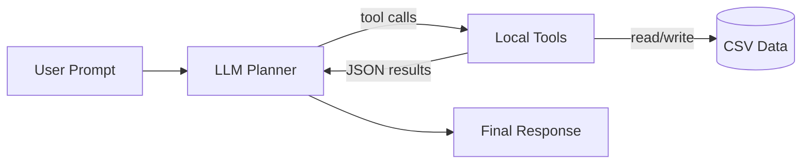

# Industrial Time Series Analyst Agent
## 工业时间序列数据分析智能体

SRTP（大学生创新创业训练计划）项目，目标是构建一套可复现、可扩展的工业时间序列分析智能体系统。LLM 负责任务规划与工具编排，数值计算与模型执行在本地完成，保证结果可验证。

## Overview
This repository provides a local tool-calling pipeline for industrial time-series analysis. The system reads a CSV file, imputes missing values, detects anomalies, and produces a baseline forecast, with every step returning structured JSON for downstream reporting.

## Key Capabilities
- Deterministic local computation with structured JSON outputs
- Tool-calling workflow with sequential task orchestration
- Configurable baseline forecasting methods for rapid iteration
- Clear extension points for adding new tools and models

## Architecture
### Current Implementation


### Target Architecture
Planned LangGraph pipeline:
- Preprocess Agent: missing value handling, anomaly control, data quality checks
- Analysis Agent: trend, seasonality, stationarity, risk diagnostics
- Validation Agent: model selection, hyperparameter search, validation metrics
- Forecast Agent: single model forecasting, ensembles, test metrics
- Report Agent: structured reporting and experiment summaries

## Repository Layout
```text
srtp/
  agent/
    core_brain.py           # Tool-calling loop
    prompts.py              # Prompt templates
  tools/
    anomaly_detection.py    # Isolation Forest anomaly detection
    data_imputation.py      # Missing value imputation
    data_summary.py         # Dataset summary
    registry.py             # Tool schema registry
    time_series_forecast.py # Baseline forecasting
  data/
    sample_data.csv         # Demo dataset
  main.py                   # CLI entrypoint
  config.py                 # Environment loading helpers
  requirements.txt
  test_data.py
```

## Requirements
- Python 3.10+

## Quick Start
1) Create and activate a virtual environment (optional)
```bash
python -m venv .venv
```

2) Install dependencies
```bash
pip install -r requirements.txt
```

3) Set API key (either environment variables or .env file)
```bash
DEEPSEEK_API_KEY=your_key_here
```

4) Run the pipeline
```bash
python main.py --data data/sample_data.csv --column temperature
```

## Configuration
### Environment Variables
| Name | Description |
| --- | --- |
| DEEPSEEK_API_KEY | API key for DeepSeek compatible endpoint |
| OPENAI_API_KEY | API key for OpenAI compatible endpoint |
| DEEPSEEK_BASE_URL | Override base URL for DeepSeek compatible endpoint |
| OPENAI_BASE_URL | Override base URL for OpenAI compatible endpoint |

### CLI Arguments
| Argument | Description | Default |
| --- | --- | --- |
| --data | CSV file path | data/sample_data.csv |
| --column | Target column | temperature |
| --impute-method | mean or forward | mean |
| --contamination | Anomaly ratio | 0.1 |
| --forecast-steps | Forecast steps | 5 |
| --forecast-method | moving_average, ewm, last | moving_average |
| --forecast-window | Moving average window | 5 |
| --forecast-alpha | EWM alpha | 0.4 |
| --model | LLM model name | deepseek-chat |
| --base-url | Override base URL | resolved from env |
| --max-steps | Max tool loop steps | 6 |
| --output-dir | Output folder | outputs |
| --env-file | Env file path | .env |
| --log-level | Logging level | INFO |

## Tool Interfaces
| Tool | Module | Description |
| --- | --- | --- |
| extract_data_summary | tools/data_summary.py | Dataset summary and missing value stats |
| impute_missing_values | tools/data_imputation.py | Missing value imputation |
| detect_anomalies | tools/anomaly_detection.py | Isolation Forest anomaly detection |
| forecast_series | tools/time_series_forecast.py | Baseline forecasting |

## Data Contract
- Input file must be a CSV file readable by pandas
- Target column should be numeric for anomaly detection and forecasting
- Timestamp column is optional but recommended for downstream reporting

## Outputs
Each run produces a JSON trace under outputs/:
```
outputs/run_YYYYMMDD_HHMMSS.json
```
The trace includes the user prompt, tool calls, tool outputs, and the final response.

## Development
To add a new tool:
1) Implement the function in tools/
2) Register it in tools/registry.py
3) Update agent/prompts.py if the workflow order changes

## Testing
Basic data check:
```bash
python test_data.py
```

## Project Status
Completed:
- Tool-calling pipeline with local execution
- Data summary, missing value handling, anomaly detection
- Baseline forecasting with configurable methods

In progress:
- Advanced forecasting models (ARIMA, Prophet, ETS)
- Visualization and report generation
- Multi-agent collaboration and validation

## References
- Zhao, H., et al. TimeSeriesScientist: A General-Purpose AI Agent for Time Series Analysis. arXiv:2510.01538.
- Liu, F. T., Ting, K. M., Zhou, Z.-H. Isolation Forest. ICDM 2008.
